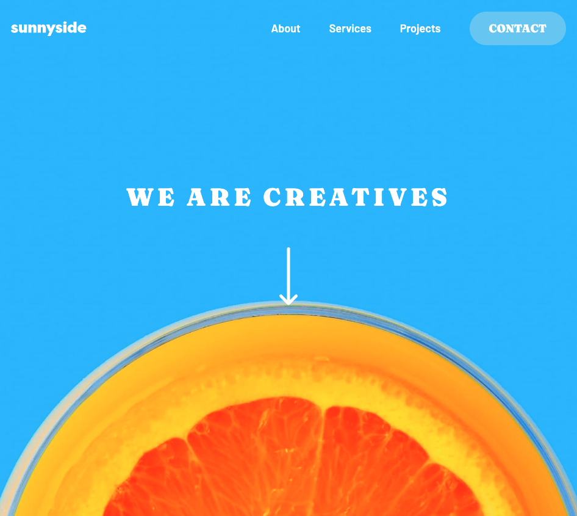

# Frontend Mentor - Sunnyside agency landing page solution

This is a solution to the [Sunnyside agency landing page challenge on Frontend Mentor](https://www.frontendmentor.io/challenges/sunnyside-agency-landing-page-7yVs3B6ef). Frontend Mentor challenges help you improve your coding skills by building realistic projects.

## Table of contents

## Overview

### The challenge

Users should be able to:

-   View the optimal layout for the site depending on their device's screen size
-   See hover states for all interactive elements on the page

### Screenshot

### Links

-   Solution URL: [GitHub](https://github.com/jakegodsall/fm-sunnyside-landing)
-   Live Site URL: [Netlify](https://jakegodsall-sunnyside-landing-page.netlify.app/)

## My process

### Built with

-   [React](https://reactjs.org/) - JS library
-   [Next.js](https://nextjs.org/) - React framework
-   [TailwindCSS](https://tailwindcss.com/) - Utility-first CSS framework
-   [Framer Motion](https://www.framer.com/motion/) - Animation library

## Author

-   Website - [Jake Godsall](https://jakegodsall.com)
-   Frontend Mentor - [@jakegodsall](https://www.frontendmentor.io/profile/jakegodsall)
-   LinkedIn - [@godsalljake](https://www.linkedin.com/in/godsalljake/)

## License

This project is open source and available under the [MIT License](./LICENSE).
